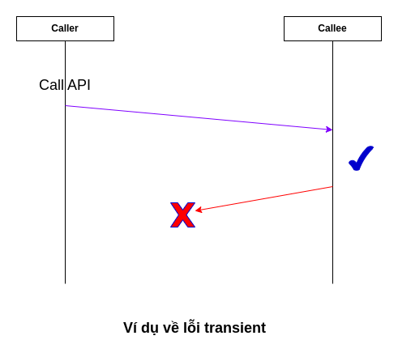

# Synchronous Saga Pattern sử dụng API

Trong bài này chỉ là một trong những cách thức implement Saga Pattern sử dụng
Database và API đơn giản. Có thể implement mà không cần bất kì một library hay
một framework nào. Tuy nhiên chỉ giới hạn trong bài toán Saga thông qua gọi Synchronous API.

### Phân loại lỗi trong quá trình gọi API

Khi một service này gọi service kia trong kiến trúc Microservices, một API có thể gặp
nhiều loại mã lỗi, ví dụ: lỗi mạng, lỗi invalid input, lỗi không truy cập DB,...

Do những API trong một Saga thường luôn là các API thực hiện thay đổi dữ liệu, nên mình cũng không xét đến
những API chỉ đọc (readonly) trong bài này.

Để thuận tiện cho việc mô tả thuật toán Saga, mình sẽ chia các lỗi ra thành 2 loại lỗi sau khi gọi một API:

* Loại lỗi **persistent**: là loại lỗi trả về khi gọi API mà bên gọi (**caller**) có thể chắc chắn rằng bên đầu
  nhận (**callee**) không thực hiện ghi dữ liệu thành công vào DB hoặc ghi vào DB nhưng đã bị rollback. Điển hình
  của lỗi này ví dụ như: sai input, lỗi resource không tồn tại, lỗi không thỏa mãn
  một precondition nào đó trong luồng logic, lỗi deadlock detected và transaction bị rollback.

* Loại lỗi **transient**: là những loại lỗi còn lại, ví dụ lỗi mạng,
  lỗi không kết nối được database, lỗi request timeout,...



Có nhiều người thường bị nhầm lẫn lỗi mạng hay lỗi kết nối vào database là đầu nhận (**callee**) đã không
nhận được request nhưng điều đó là sai lầm vì đầu nhận (**callee**) hoàn toàn có thể
ghi nhận request và trong quá trình response service bị sập, network bị timeout do thời gian xử lý lâu.
Vì vậy trong hệ phân tán nói chung, nếu gặp một lỗi **transient** thì bên **caller** sẽ không được phép
giả định rằng **callee** đã không nhận được request.

### Vấn đề về thứ tự của các API trong network

Mình đã từng gặp rất nhiều trường hợp hiểu sai rằng khi gọi bằng API thì thứ tự sẽ được đảm bảo,
điển hình như ví dụ sau:

1) Một biến version lưu trong db có giá trị ban đầu là 0.
2) Một thread thực hiện update version lên = 1 và sau khi quá trình lưu db
   thành công và gọi sang remote service khác với request có version = 1
3) Trong quá trình thread trước đó đang gọi remote service, một thread khác thực hiện update version lên = 2
   và sau đó cũng thực hiện gọi sang cùng remote service với version = 2


Có người sẽ nghĩ rằng remote service sẽ chắc chắn cũng ghi nhận version = 2 nhưng mà giả định đó là sai.
Vì khi thread đầu tiên gọi remote service có thể request đó bị delay ở network, có thể quá trình
load balance làm request đầu tiên đến được một instance mà đang chạy GC lâu, hoặc tương tự.
Điều đó có thể dẫn đến request thứ 2 lại được xử lý trước request thứ nhất.
Khi mà xử lý API để đảm bảo consistency thì hệ thống cũng phải tính đến những trường hợp này.

### Mô hình bài toán

Trước khi đi đến thuật toán Saga tổng quát, mình sẽ giới thiệu thuật toán đảm bảo tính
chất Atomicity cho 2 service đơn giản (và có phần không đúng với thực tế :v) sau:

* **Order Service**: nơi nhận request tạo order từ người dùng và gọi lên Inventory Service
  để trừ số lượng tồn kho của sản phẩm.
* **Inventory Service**: đầu nhận request từ phía Order Service, quản lý số lượng tồn kho.


Đầu Order Service sẽ có một API là Create Order API, đầu Inventory Service sẽ có 2 API là
Reserve Product Quantity và Cancel Reserve Product Quantity. Hai API này sử dụng chung một giá
trị **request_id** giữa API Reserve và API Cancel của cùng một Flow để Inventory xác định dữ liệu Cancel là gì.

Một request của người dùng sẽ đồng thời tạo Order trên Order Service
và thực hiện update trên Inventory Service. Tính chất Atomicity mà thuật toán Saga đạt được
là phải đảm bảo:

* Hoặc là cả 2 service đều ghi nhận thành công
* Hoặc là cả 2 service đều không ghi nhận dữ liệu hoặc ghi nhận dữ liệu với trạng thái là **Cancelled**.

### Thuật toán thứ nhất (thuật toán sai)

Quá trình Create Order API xử lý như sau:

1) Gọi Reserve Product Quantity sang bên Inventory Service.
2) Nếu lỗi trả về là lỗi **persistent** => trả về cho người dùng lỗi không tạo được order.
3) Nếu lỗi trả về là lỗi **transient** => thực hiện gọi API Cancel.
4) Nếu gọi inventory thành công => thực hiện logic tạo Order.
5) Nếu logic tạo order thành công, không có validation nào fail => commit và trả về success cho người dùng.
6) Nếu logic tạo order không thành công => không commit và thực hiện gọi API Cancel của Inventory.

Có thể thấy những vấn đề hiển nhiên của hướng giải quyết này:

* Nếu ở bước 4 trước khi tạo Order mà instance (pod trên K8s) không thể tiếp tục do bị kill sẽ dẫn
  đến quantity đã bị reserve nhưng order không được tạo
* Ở bước 3 nếu lỗi **transient** thì khả năng cao là API Cancel
  gọi ngay sau đó cũng không thể gọi được => dẫn đến quantity cũng đã có thể bị reserve nhưng không thể
  cancel được quá trình reserve do network thường mất một thời gian mới có thể hồi phục.
* Ở bước 6 tương tự như ở bước 4, nếu trong quá trình này instance bị kill cũng sẽ dẫn đến inconsistency.

### Thuật toán thứ hai (không hoàn toàn đúng)

Ở thuật toán thứ nhất, có thể thấy là do việc ta không ghi nhận gì trước khi
gọi Reserve Product Quantity dẫn đến hệ thống không thể biết được cần phải thực hiện Cancel sau đó
nếu như instance bị fail.
Từ đó ý tưởng là trước khi thực hiện gọi Reserve sẽ phải thực hiện insert một bản ghi **log**
vào trong Database, sau khi việc ghi thành công thì mới thực hiện gọi Reserve. Và quá trình gọi Cancel
có thể dùng Job để scan bảng **log** và gọi Cancel Reserve khi mà phát hiện **log** record nào quá
lâu mà chưa được xử lý.

Chi tiết thuật toán như sau:

Ta sẽ có thêm một bảng có tên **request_log**, có các field:

* **id**: là PRIMARY KEY AUTO INCREMENT, giá trị **request_id** của API Reserve và API Cancel.
* **status**: Có 3 giá trị là **Requesting**, **Completed**, **Failed** và **Cancelled**.
* **status_expired_at**: Là trường lưu trữ thời gian mà trạng thái **Requesting** đã quá hạn và Job Cancel
  có thể quét ra và xử lý.

Các bước của thuật toán bao gồm:

1) Insert vào bảng **request_log** với **status** = **Requesting** và **status_expired_at** =
   thời gian hiện tại + một khoản thời (ví dụ 60s).
2) Sau khi insert thành công, thực hiện gọi API Reserve Product Quantity.
3) Nếu lỗi trả về là lỗi **persistent** => thực hiện update **status** = **Failed**
4) Nếu lỗi trả về là lỗi **transient** => thực hiện gọi
   API Cancel Reserve Product Quantity => rồi sau đó update **status** = **Cancelled**
5) Nếu gọi Reserve thành công => thực hiện logic tạo Order trên Order Service.
6) Nếu logic tạo Order thành công => update **status** = **Completed** và commit transaction.
7) Nếu logic tạo Order thất bại => thực hiện gọi API Cancel Reserve => sau khi cancel thành công
   sẽ update **status** = **Cancelled**.

Đồng thời ta sẽ có một Job thực hiện quét những **request_log** nào mà **status** = "Requesting"
**Và** **status_expired_at** <= NOW(). Có thể sử dụng composite index trên 2 cột
là **status** và **status_expired_at** để quá trình quét không phải thực hiện scan lại database.

Với những record tìm được ở bước quét sẽ thực hiện lại bước 7 ở trên:
Gọi API Cancel => rồi update **status** = **Cancelled**.

Với hướng giải quyết này thì 3 vấn đề ở thuật toán thứ nhất trên có thể được giải quyết triệt để.
Tuy nhiên nếu để **status_expired_at** = NOW() + một khoảng thời gian không đủ lớn.
Thì có thể xảy ra tình huống sau:

1) Insert vào bảng **request_log** với **status** = **Requesting** thành công
2) Sau đó thực hiện API Reserve thành công
3) Trong quá trình đó, do xử lý của API lâu, thời gian **status_expired_at** đã <= NOW(). Job quét
   quét ra được bản ghi **request_log** và thực hiện gọi API Cancel
4) Thread gốc do API Reserve thực hiện thành công ở bước trên, vẫn thực hiện xử lý logic tạo Order
   ở Order Service.
5) Thread gốc tạo Order, update **status** và commit thành công => Trả về cho người dùng kết quả Success.
6) Job quét thực hiện API Cancel thành công và update **status** = **Cancelled**

Có thể thấy trong trường hợp này dữ liệu đã bị inconsistent vì trên Order Service ghi nhận Order thành công
nhưng Inventory Service quá trình Reserve Product Quantity đã bị Cancel.

Vấn đề trên có thể giải quyết bằng việc tăng duration của **status_expired_at** lên đủ lớn. Tuy nhiên
bản thân mình không muốn tính đúng sai của một thuật toán lại phụ thuộc vào giá trị thời gian không
chắc chắn như vậy =))))

### Thuật toán thứ ba (thuật toán đầy đủ chạy đúng)

Thuật toán này là bổ sung của thuật toán ở trên, thay vì **status** chỉ có thể là 1 trong 4 giá trị:

**Requesting**, **Completed**, **Failed** và **Cancelled**.

Ta sẽ bổ sung thêm status thứ 5 có tên là **Aborting**.
Ý tưởng là với Thread xử lý chính để có thể thực hiện update **status** = **Completed**
thì phải check **status** trước đó vẫn là **Requesting**. (Phương thức này gọi chung là **Compare And Set**)

Còn Job quét ra bản ghi **request_log** thì chỉ được gọi API Cancel Reserve **sau khi** đã
update **status** = **Aborting** và tương tự chỉ được phép update như vậy khi mà **status** trước đó
là **Requesting**.

Thuật toán đầy đủ sẽ như sau:

1) Insert vào bảng **request_log** với **status** = **Requesting** và **status_expired_at** =
   thời gian hiện tại + một khoản thời (ví dụ 60s).
2) Sau khi insert thành công, thực hiện gọi API Reserve Product Quantity.
3) Nếu lỗi trả về là lỗi **persistent** => thực hiện update **status** = **Failed**
4) Nếu lỗi trả về là lỗi **transient** => thực hiện gọi
   API Cancel Reserve Product Quantity => rồi sau đó update **status** = **Cancelled**
5) Nếu gọi Reserve thành công => thực hiện logic tạo Order trên Order Service.
6) Nếu logic tạo Order thành công => update **status** = **Completed** **chỉ khi**
   giá trị **status** trước đó là **Requesting** và commit transaction.
7) Nếu logic tạo Order thất bại => thực hiện gọi API Cancel Reserve => sau khi cancel thành công
   sẽ update **status** = **Cancelled**.

Job quét sẽ thực hiện quét những **request_log** nào mà
(**status** = **Requesting** **HOẶC** **status** = **Aborting**)
**Và** **status_expired_at** <= NOW().

Với những record tìm được ở bước quét sẽ thực hiện lại bước 7 ở trên:

1) Nếu **status** quét ra mà là **Requesting**, thực hiện **Compare And Set** update giá trị của
   **status** = **Aborting** **chỉ khi** **status** trước đó là **Requesting**.
2) Nếu **status** trước đó là **Aborting** hoặc quá trình **Compare And Set** thành công =>
   sẽ thực hiện Gọi API Cancel Reserve => rồi sau đó update **status** = **Cancelled**.
3) Nếu quá trình **Compare And Set** thất bại sẽ thực hiện **bỏ qua** và **quét lại** bảng **request_log** sau đó.

#### Compare And Set (CAS) bằng SQL

Để thực hiện CAS, ta có thể sử dụng câu query SQL dạng như sau:

```sql
UPDATE request_log
SET status = "Completed"
WHERE id = ?
  AND status = "Requesting"
```

Và check số lượng row bị **thay đổi** để biết CAS có thành công hay không.

### Tính chất của API Reserve và API Cancel

Để thuật toán Saga ở trên chạy đúng thì 2 API là Reserve và
Cancel Reserve cần phải thỏa mãn các tính chất sau:

* API Cancel không được phép có trả về lỗi **persistent**, chỉ được phép có lỗi **transient**.
* API Cancel phải có tính chất idempotent để khi gặp lỗi **transient** thì đầu gọi (caller) có thể
  thực hiện retry cho đến khi quá trình Cancel thành công.
* Để đảm bảo tính chất Idempotent của API Cancel có thể đơn giản là check đã có bản ghi nào với
  **request_id** đã nhận được và trạng thái đã được Cancel chưa. Nếu đã Cancel thì chỉ thực hiện trả về Success
  cho phía caller.
* **Quan trọng**: Phải cho phép API Cancel được gọi **trước** API Reserve và nếu API Cancel gọi trước
  thì API Reserve phải trả về lỗi **persisent** báo là **request_id** gửi lên đã bị Cancel.
* API Reserve không cần nhất thiết phải đảm bảo tính chất idempotent.
  Tuy nhiên nếu idempotent không được đảm
  bảo thì **tuyệt đối KHÔNG** được gọi retry cho API này.

Tại sao tính chất về API Cancel cho phép xử lý trước API Reserve cần được đảm bảo vì
trường hợp sau:

1) Thread chính thực hiện gọi API Reserve nhưng vì mạng bị chậm request bị treo trên đường mạng
2) API Reserve bị timeout (lỗi **transient**), thread chính (hoặc Job) sẽ thực hiện API Cancel.
3) Sau khi API Cancel trả về Success, Thread chính update trạng thái của **request_log** thành **Cancelled**
4) Sau đó request của API Reserve bị treo trên đường mạng cuối cùng cũng đến được Inventory Service.
   Nếu mà Inventory không nhận ra đây là **lỗi** mà vẫn chấp nhận request thì sẽ gây nên inconsistency do
   Inventory Service vẫn ghi nhận mà Order Service báo là đã fail.
